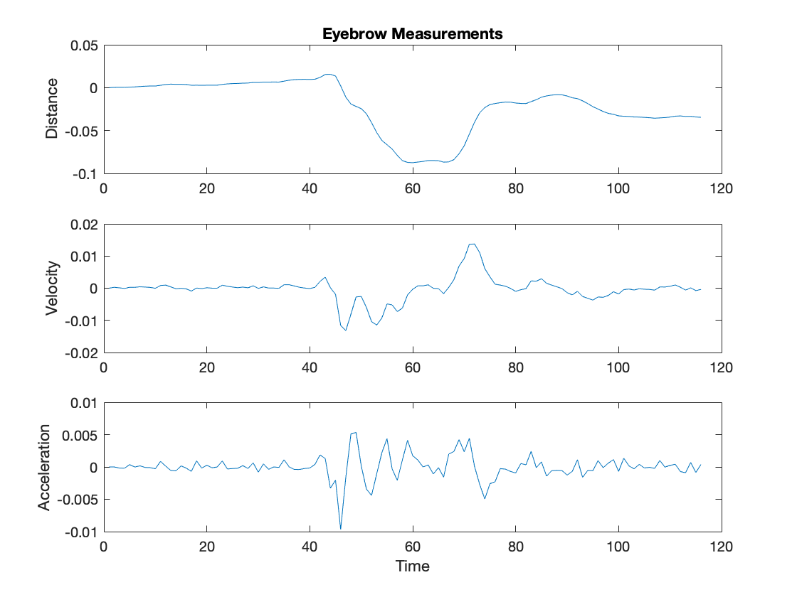

# AVC (Audio-Visual Communication) #

## Speech Communications ##

This code was tested on ```mp4``` files. In case of issues reading video files, check the codecs or use different read function (e.g. ```mmread``` function was also found to be useful to read the audio/video data).

There are some issues in reading video files using ```MATLAB```'s videoReader function on MAC OS. This issue may also occur on other platforms.

```avc_main.m``` is the main function file to run the code.

```data``` folder contain some sample data to run the code. 

```avc_readData```: Function that reads the video files. 
```avc_readLabels```: Specific to this project. Parse the filename for different labels.
```avc_videosegment```: returns the frame number of the first and the last frame in video where the audio is present.
```detectLips```: detect keypoints on lips. uses LBP cascade filter to detect mouth.


```detectEyes```: detect keypoints on eyebrow. Internally calls detectEyebrow.m


```detectNose```: detect keypoints on head.


```pickpoints```: this function picks one keypoint from various detected keypoints in one region.
uses vision.PointTracker based KLT tracker to track the detected keypoints.

```avc_extractHeadFeatures```: compute features based on the detected keypoint trajectory.




```classify2.m``` and ```classify3.m``` contains code for random forest and the modified implementation of Paul's random forest method.
