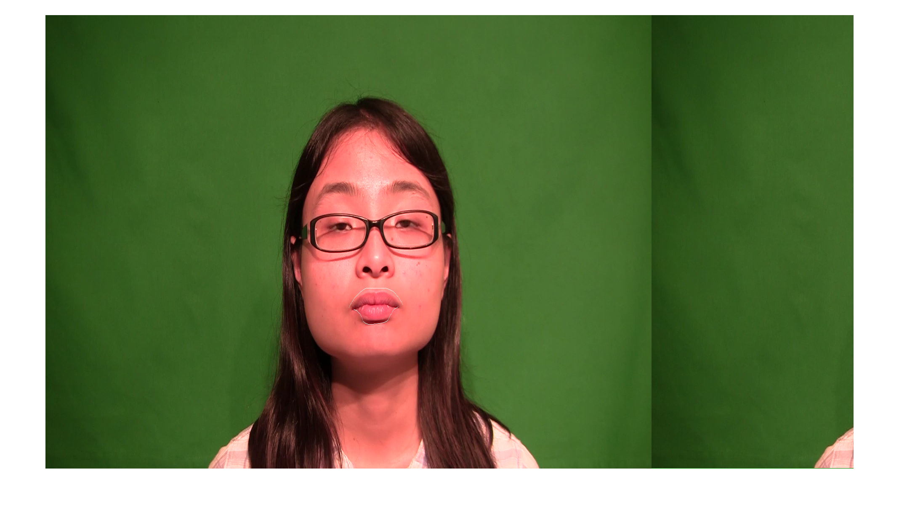
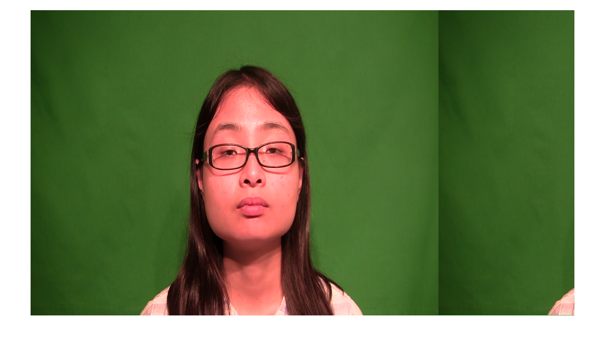

# avc
Speech Communications

This code was tested on mp4 files. In case of issues reading video files, check the codecs or use different function. 
"mmread" function was also found to be useful to read the audio/video data.

There is some issue in reading video files using MATLAB's videoReader function on MAC OS. I have not tested on other platforms
to confirm if the issue is still there on other platforms.

avc_main.m is the main function file to run the code.

data folder contain some sample data to run the code. 

avc_readData.m: Function that reads the video files. 
avc_readLabels: Specific to this project. Parse the filename for different labels.
avc_videosegment.m: returns the frame number of the first and the last frame in video where the audio is present.
detectLips.m: detect keypoints on lips. uses LBP cascade filter to detect mouth.

detectEyes.m: detect keypoints on eyebrow. Internally calls detectEyebrow.m

detectNose.m: detect keypoints on head.

pickpoints.m: this function picks one keypoints from various detected keypoints in one region.
uses vision.PointTracker based KLT tracker to track the detected keypoints.

avc_extractHeadFeatures.m: compute features based on the detected keypoint trajectory.

classify2.m and classify3.m contains code for random forest and the modified implementation of Paul's random forest method.
